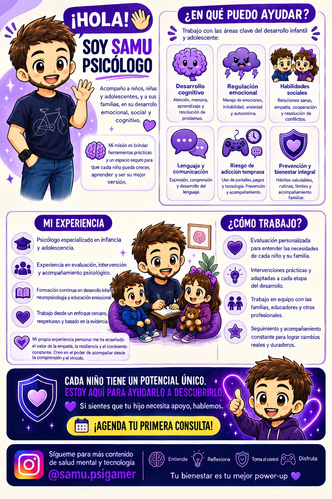

<!doctype html>
<html lang="es">
<head>
<meta charset="utf-8">
<meta name="viewport" content="width=device-width, initial-scale=1">
<meta name="description" content="Samu Psicólogo — psicología, infancia, adolescencia, gaming y tecnología.">
<title>Samu Psicólogo · Salud mental + Gaming + Tecnología</title>
<link rel="stylesheet" href="styles.css">
</head>
<body>

<header class="header">
  <a class="brand" href="#inicio">✦SamuPsicólogo</a>
  <button class="menu" aria-label="Abrir navegación">☰</button>
  <nav>
    <a href="#sobre-mi">Sobre mí</a>
    <a href="#servicios">Servicios</a>
    <a href="#pantallas">Pantallas</a>
    <a href="#gaming">Gaming</a>
    <a href="#recursos">Recursos</a>
    <a class="nav-cta" href="#contacto">Contactar</a>
  </nav>
</header>

<main>
<section id="inicio" class="hero">
  

    
 PSICOLOGÍA · GAMING · TECNOLOGÍA

    <h1>Salud mental para crecer en un mundo <em>digital.</em></h1>
    
Psicología cercana para niños, adolescentes y familias. Entender las emociones, el desarrollo y también el mundo de las pantallas y los videojuegos.

    

      <a class="btn primary" href="#contacto">Quiero hablar contigo <b>→</b></a>
      <a class="btn ghost" href="#pantallas">¿Te preocupan las pantallas?</a>
    

    
✦ Enfoque cercano✦ Herramientas prácticas✦ Familia + contexto digital

  

  

    

    
<small>PLAYER PROFILE</small><strong>SAMU</strong>PSICÓLOGO · LVL ∞

    
    
🧠<b>Samu</b>

    
XP<strong>+100</strong><small>HERRAMIENTAS</small>

    
🎮

  

</section>

<section id="sobre-mi" class="section">
  
01 · SOBRE MÍ

  
<h2>Soy Samu, psicólogo. Y entiendo el mundo gaming.</h2>
La tecnología forma parte de la vida cotidiana. Por eso también puede formar parte de una conversación psicológica útil y sin prejuicios.

  

    

      
Mi objetivo es crear un espacio en el que niños, adolescentes y familias puedan entender qué está pasando, adquirir herramientas y avanzar paso a paso.

      
Me interesa especialmente la intersección entre <strong>salud mental, desarrollo, videojuegos y tecnología</strong>: hábitos digitales, regulación emocional, diseño de recompensas, uso de pantallas y prevención.

      <blockquote>“No se trata de demonizar la tecnología. Se trata de aprender a relacionarnos con ella.”</blockquote>
    

    

      
🧠● ONLINE

      <h3>Samu Psicólogo</h3>
Infancia · Adolescencia · Familias

      
Psicología<i><b style="width:92%"></b></i>

      
Gaming & tecnología<i><b style="width:88%"></b></i>

      
Divulgación<i><b style="width:90%"></b></i>

    

  

</section>

<section id="servicios" class="section services">
  
02 · SERVICIOS

  
<h2>¿En qué podemos trabajar?</h2>
Un acompañamiento adaptado a la edad, al contexto y a las necesidades de cada persona.

  

    <article>01
🧠
<h3>Desarrollo cognitivo</h3>
Atención, aprendizaje, memoria, organización y resolución de problemas.
</article>
    <article>02
💜
<h3>Regulación emocional</h3>
Emociones, autoestima, frustración, ansiedad e irritabilidad.
</article>
    <article>03
🤝
<h3>Habilidades sociales</h3>
Empatía, comunicación, relaciones y resolución de conflictos.
</article>
    <article>04
💬
<h3>Lenguaje y comunicación</h3>
Comprensión, expresión y herramientas para comunicarse con seguridad.
</article>
    <article>05
🎮
<h3>Gaming y pantallas</h3>
Hábitos digitales, videojuegos, límites y prevención de usos problemáticos.
</article>
    <article>06
🛡️
<h3>Orientación familiar</h3>
Rutinas, acuerdos, límites y estrategias para el día a día.
</article>
  

</section>

<section id="pantallas" class="section concern">
  

    

      
03 · PARA FAMILIAS

      <h2>¿Te preocupa el uso de pantallas de tu hijo?</h2>
      
Antes de pensar únicamente en “cuánto tiempo”, podemos mirar <strong>para qué, cuándo, cómo y qué está sustituyendo</strong> ese uso.

      
¿Afecta al sueño?¿Cuesta parar?¿Hay irritabilidad?¿Está desplazando otras actividades?

      <a class="btn primary" href="#contacto">Quiero orientación →</a>
    

    

      
HÁBITO DIGITAL<b>ANÁLISIS</b>

      
🧠

      
Sueño<i><b></b></i>

      
Juego<i><b></b></i>

      
Relaciones<i><b></b></i>

      
Rutinas<i><b></b></i>

      <small>No existe una única medida que sirva para todas las familias.</small>
    

  

</section>

<section id="gaming" class="gaming section">
  
04 · GAMING + TECNOLOGÍA

  

    

      <h2>Comprender el videojuego también es comprender al jugador.</h2>
      
Los videojuegos pueden aportar ocio, aprendizaje y conexión. Al mismo tiempo, algunos sistemas de diseño —recompensas variables, loot boxes, pases de batalla, micropagos o eventos temporales— pueden influir en cómo interactuamos con ellos.

      
🎮 Gaming🧠 Recompensa⚡ Hábitos📱 Pantallas🛡️ Prevención

    

    

      
● ● ●<b>PLAYER_MIND.EXE</b>

      

🧠

🎮

      

      

RECOMPENSA <b>VARIABLE</b>

HÁBITO DIGITAL <b>ANALIZADO</b>

AUTOCONTROL <b>+100 XP</b>

    

  

</section>

<section id="recursos" class="section resources">
  
05 · DIVULGACIÓN

  
<h2>Psicología que puedes usar.</h2>
Contenido claro para entender mejor el desarrollo y la relación con la tecnología.

  

    <article>🎮<small>GAMING</small><h3>Loot boxes y recompensas</h3>
Qué hay detrás de las recompensas variables y por qué importa conocer su diseño.
</article>
    <article>📱<small>INFANCIA</small><h3>Pantallas de 0 a 2 años</h3>
Desarrollo, lenguaje, regulación emocional y la importancia de las experiencias compartidas.
</article>
    <article>💜<small>FAMILIAS</small><h3>Más allá del “quita el móvil”</h3>
Cómo construir límites, alternativas y hábitos digitales que puedan mantenerse.
</article>
  

</section>

<section class="section method">
  
06 · CÓMO TRABAJO

  

    
<h2>Un proceso claro, paso a paso.</h2>
Pedir ayuda no debería sentirse como entrar en un laberinto.

    

      
<b>01</b><h3>Escuchamos</h3>
Situación, contexto y objetivos.

      
<b>02</b><h3>Definimos</h3>
Prioridades y objetivos realistas.

      
<b>03</b><h3>Entrenamos</h3>
Herramientas prácticas y adaptadas.

      
<b>04</b><h3>Avanzamos</h3>
Seguimiento y ajustes.

    

  

</section>

<section id="contacto" class="contact section">
  

    

07 · CTA
<h2>¿Hablamos?</h2>
Si quieres saber si puedo ayudarte, escríbeme y cuéntame brevemente qué está ocurriendo.

    
<a class="btn yellow" href="mailto:tuemail@ejemplo.com?subject=Consulta%20psicológica">Enviar un email →</a><a class="btn outline" href="https://instagram.com/samu.psigamer" target="_blank" rel="noopener">Instagram · @samu.psigamer</a>

  

</section>
</main>

<footer>
<strong>SamuPsicólogo</strong>
Salud mental · infancia · adolescencia · gaming · tecnología

<a href="https://instagram.com/samu.psigamer" target="_blank" rel="noopener">@samu.psigamer</a><small>©  · Información general; no sustituye una evaluación psicológica profesional.</small></footer>

</body></html>